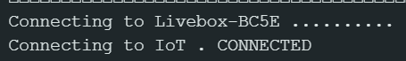
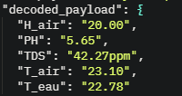
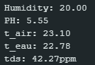
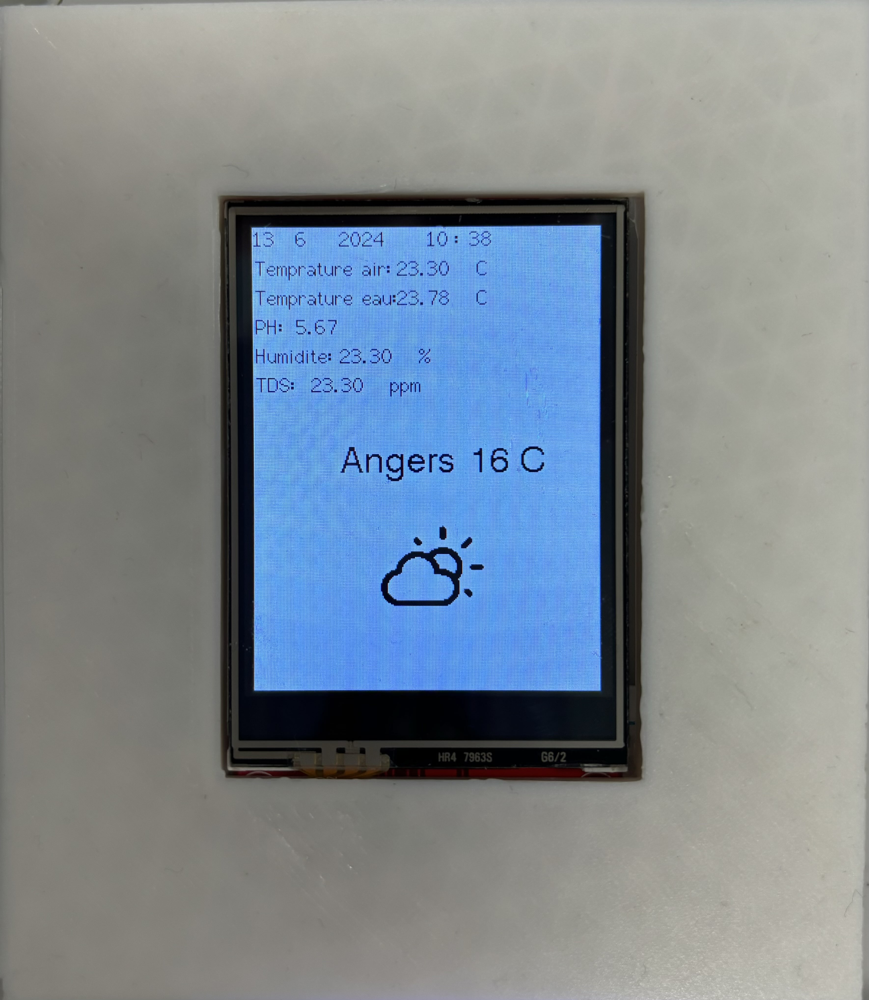

# Code Station de base

## Configuration

Logiciel `Aduino IDE 2.3.2`

Librairie `WiFi.h`, `esp_wifi.h`, `TFT_eSPI.h`, `WiFiClientSecure.h`, `Arduino_JSON.h`, `SPI.h`, `PubSubClient.h`

Carte utilisée `ESP32 WROOM WiFi` par Espressif Systems

Ajouter votre réseau internet, votre token pour la météo et les informations du serveur MQTT dans le fichier [credential.h](/Code/main_station_base/credential.h)

Dans le fichier [config.h](/Code/main_station_base/config.h), n'oubliez pas de compléter les informations sur l'API de la météo (ligne 54 à 62).
Si vous souhaitez utiliser l'API _OPEN_WEATHER_ ajouter un `1` après la déclaration sinon `0` (de même pour utiliser l'API _METEO_CONCEPT_)

Dans le fichier [main_station_base.ino](/Code/main_station_base/main_station_base.ino), vous devez remplacer la string _TOPIC_NAME_ le topic que vous lire, le _PORT_, _SIZE_BUFFER_ (si besoin) ainsi que les valeurs des sous-topic telque sour la forme suivante `#define TOPIC_NOM_SOUS_TOPIC "nom_sous_topic"`. Le nom du sous-topic doit être celui qui est présent dans votre document JSON

> [!WARNING]
> Pour utiliser votre IPhone comme point d'accès, n'oubliez pas de cocher la case "Maximiser la compatibilité". Sans cette activation, la connexion ne pourra se faire.

## But du code

Afficher sur un écran les informations renvoyées et complémentaire par la station extérieure.

## Pins

#### Carte ESP32 WROOM

| ESP32 WROOM Pin | Ecran TFT |
| :-------------: | :-------: |
|       GND       |    GND    |
|       D15       |    CS     |
|       D4        |   RESET   |
|       D2        |    DC     |
|       D23       |   MOSI    |
|       D18       |    SCK    |
|       D19       |   MISO    |
|      3,3V       | LED + VCC |

## Différentes parties du code

### Connexion de l'ESP32 WROOM WiFi.

### Récupération des informations de la station extérieure via des requêtes MQTT.

Envoie de la trame par la SMT32

Réception de la trame par l'ESP32

### Affichage de l'horloge, de la date et de la météo.

### Affichage des informations station extérieure.

## Résultats obtenus

Sur la carte de test

Sur la carte finale

